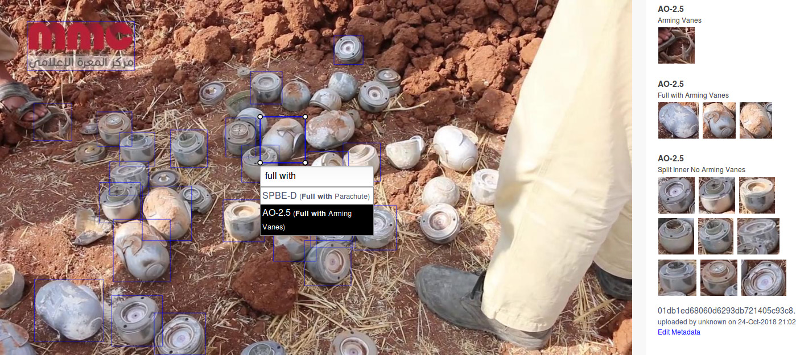
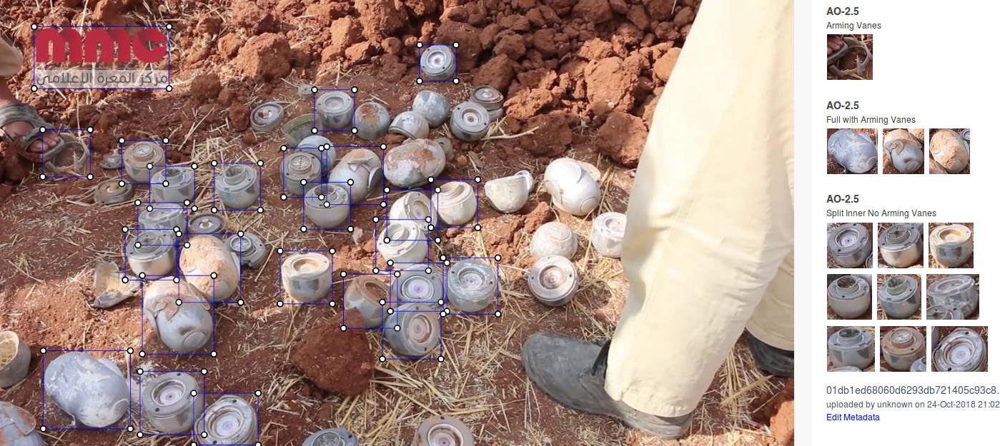
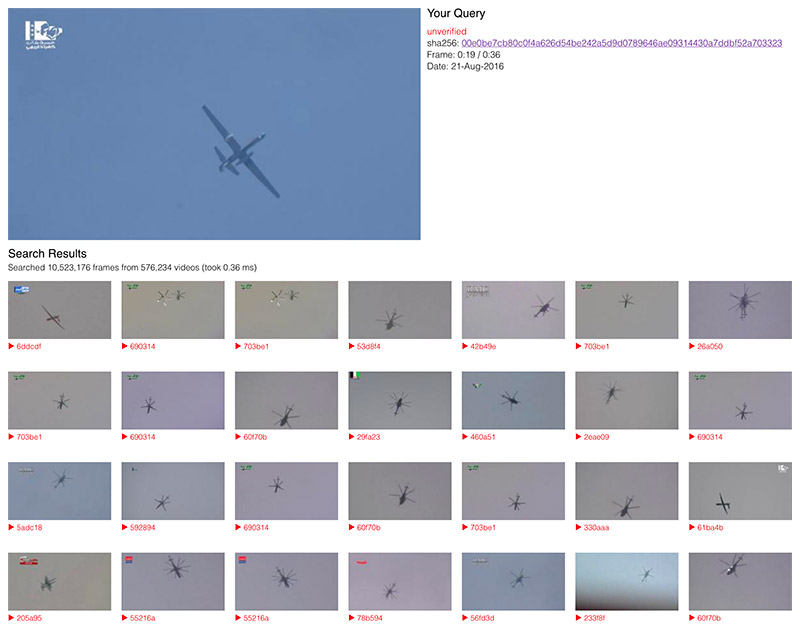
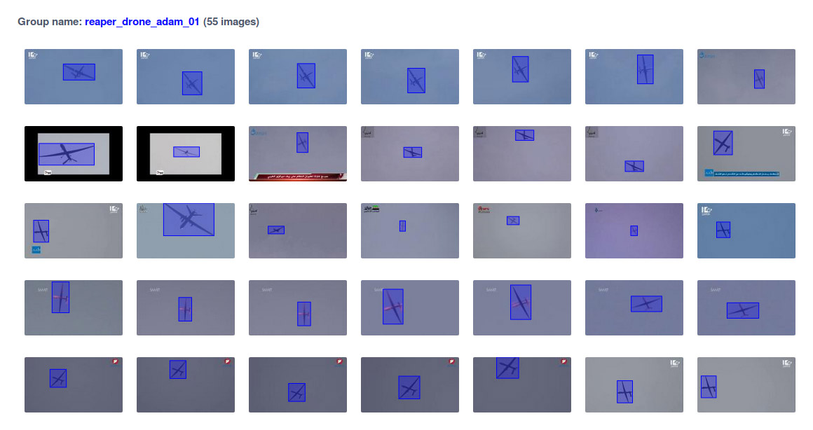

# VCAT: Visual Collection, Annotation, and Training


VCAT is a system for creating machine learning image datasets for computer vision. It uses a Django backend, React frontend, and CNN-based based visual search engine to faciliate creating new datasets and forensic image research.

VCAT is designed to be used with  <https://vframe.io> / <https://github.com/vframeio/vcat> and is intended primarily for human rights researchers.

**This project is under daily development and repo will be updated often during Oct-Nov 2018**


-------------------------

NB: Development is still under process and installlation steps may change during the next 6 months. 

## Getting Started

VCAT runs mostly in Python on an Ubuntu 16.4 server

## Prerequisites

* A conda/virtualenv virtual environment running Python 3.6+
* node v8.5.0 / npm v6.0.0 (suggest installing with nvm)
* MySQL2 (apt install libmysqlclient-dev)

## Installation

```
sudo apt install libmysqlclient-dev
```

### MySQL

Run `mysql -u root` then make a new user and database:

```
CREATE USER 'vframe'@'localhost' IDENTIFIED BY 'password';
CREATE DATABASE vframe;
GRANT ALL PRIVILEGES ON vframe.* TO 'vframe'@'localhost';
```

### Settings

Copy the settings file and edit appropriately (or ask jules for dev config):

```
cp sample-env .env
```

### Python / Django

```
source activate vcat
pip install -r requirements.txt
python manage.py migrate
python manage.py createsuperuser
```

### Node

```
npm install
```

### vsearch

The FAISS-based image search engine lives in `~/vcat/vsearch/` directory.  This is a flask server which runs seperately from the main Django app.  Instructions for installing everything are there, including another requirements.txt.  This may be moved into its own repo at some point. Instructions for setting up vsearch can be found in that folder's readme.

If using vsearch with vcat, please run its fixtures:

```
python manage.py migrate vsearch zero
python manage.py migrate
python manage.py loaddata document_tag
python manage.py import_metadata
python manage.py import_metadata --unverified
```

## Running it

Run these commands in separate tabs:

```
python manage.py runserver
npm run watch
```

Note, if developing on Linux you may need to increase the number of filesystem watchers:

```
echo fs.inotify.max_user_watches=524288 | sudo tee -a /etc/sysctl.conf && sudo sysctl -p
```

## Development

Put static images in `backend/api/static/`

## Deployment

### Building the frontend

Production bundles should be built *remotely*. Run `npm run reload` on the remote server.

Services are set up in `/etc/init.d`. Find sample init.d files in `./bin/init.d/`. If there's a problem do `service vcat restart` or `service sis restart`.

## Exporting data

For now you can curl using Basic Auth to hit endpoints like so -

```
curl -u username:password https://syrianarchive.vframe.io/api/hierarchy/1/full
```


----------------------------

## Screenshots of VCAT Application

## Annotations

*Autocomplete visual taxonomy for quick annotation*

*Toggle on/off labels for scenes with many items*

*Display labels and verify annotations*

## Search

Search for similiar images using content based image retrieval

*Search reults*

## Datasets

Use search results to create a new training dataset

*Annotated training set for aircraft*
